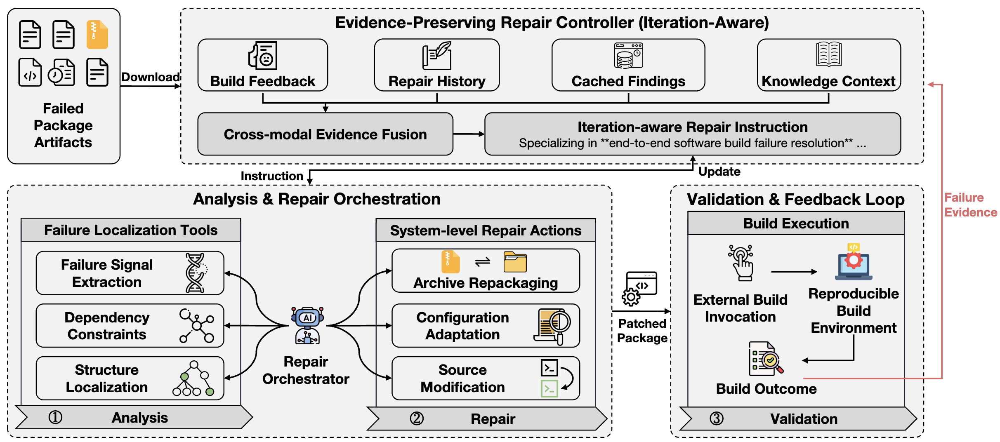

# EvidenT: Evidence-Preserving Package Repair

[](https://doi.org/10.5281/zenodo.20972389)

EvidenT is an MCP-based framework for iterative system-level package repair. It diagnoses build failures from package artifacts, applies minimal evidence-driven edits, and validates repaired packages through a configurable build backend.

The original paper workflow used the openSUSE Open Build Service (OBS). This artifact keeps that OBS path and adds a Docker-based backend as the default, so reviewers can run validation on a local machine or server without OBS credentials.

The evaluated artifact and complete 219-package dataset are archived on Zenodo:

- **Evaluated version:** [10.5281/zenodo.20972389](https://doi.org/10.5281/zenodo.20972389)

<p align="center">
  
</p>

## What EvidenT Does

1. Loads failed package artifacts: build logs, `.spec` files, patches, and source archives.
2. Extracts compact failure signals from noisy build logs.
3. Retrieves dependency constraints, historical repair cases, and RISC-V knowledge context.
4. Uses an LLM through MCP tools to make minimal package-level repairs.
5. Validates the repaired package with either:
   - `docker`: local/server-side openSUSE RPM build in Docker, default for artifact evaluation.
   - `obs`: upload and polling through OBS, retained for paper-aligned reproduction.
     See `OBS_GUIDE.md` for reviewer-owned project setup, RISC-V repository
     configuration, package upload, and build-log inspection.

## Repository Layout

```text
.
├── ARTIFACT.md                       # Reviewer-facing artifact checklist
├── OBS_GUIDE.md                      # Paper-aligned OBS backend setup guide
├── Dockerfile                        # Optional container for the EvidenT driver
├── client.py                         # MCP repair-loop client
├── server.py                         # MCP tool server
├── config/
│   ├── paths.yaml                    # Paths, run bounds, target ISA, validator backend
│   └── obs_meta.yaml                 # OBS credentials/settings for the OBS backend
├── dataset/obs_data/risc_v/          # Small committed smoke-test package
├── knowledge_base/
│   ├── history_soluction.csv         # Historical repair cases
│   └── risc_v_knowledge_base.csv     # RISC-V knowledge context
├── scripts/
│   ├── obs_bulk_upload.py            # Create/upload OBS packages in bulk
│   ├── reproduce_reduced.sh           # One-command credential-free reproduction
│   ├── smoke_test.py                 # Fast artifact sanity check
│   └── validate_package.py           # Validate one package with Docker or OBS
├── tools/
│   ├── analysis_and_repair/          # Log analysis, constraints, retrieval, localization
│   └── validation/
│       ├── check_build_res.py        # Backend dispatcher
│       ├── docker_build.py           # Docker/openSUSE RPM validator
│       └── upload_files.py           # OBS upload helper
└── utils/prompts/                    # Repair prompts
```

Runtime outputs are ignored by git: `temp_workspace/`, `auto_repair_results/`, `auto_repair_log_files/`, `structured_logs_all/`, `parsed_templates_drain/`, and `anomaly_detection_results/`.

## Getting Started

This artifact is packaged for ISSTA artifact evaluation. It contains the
EvidenT source code, configuration files, reduced RISC-V package examples, and
a preheated Docker image tarball for the RISC-V validator.

Reviewers can complete the basic setup and smoke test in under 30 minutes.

### Start Here: Credential-Free Smoke Test

The current Zenodo artifact incorporates the kick-the-tires feedback received
on the initial Docker validation case. For the shortest reviewer path, use the
submitted preheated image and the reduced `python-stomper` package:

```bash
docker load -i images/evident-opensuse-riscv64.tar.gz
uv sync
uv run python scripts/smoke_test.py
uv run python scripts/smoke_test.py --validate
```

Neither an LLM API key nor OBS credentials are required for these commands.
The final command intentionally validates an unrepaired package and succeeds
when the RISC-V build reaches the package's expected `%check` failure. Its
expected final lines are:

```text
validator_reached_expected_check_failure=ok
smoke_test=ok
```

The same sequence is available as one command:

```bash
bash scripts/reproduce_reduced.sh
```

### Requirements

- Python 3.11+
- `uv`
- Docker with Linux containers
- For RISC-V Docker validation on a non-RISC-V host: qemu/binfmt support for `linux/riscv64`; QEMU 9.2 or newer is recommended for the submitted openSUSE RISC-V image
- An OpenAI-compatible API endpoint for full LLM repair-loop runs

See `REQUIREMENTS.md`, `STATUS.md`, and `LICENSE` for the files expected by the ISSTA artifact packaging checklist.

### Setup From The Artifact Archive

Unpack the submitted archive and enter the artifact directory:

```bash
tar -xzf EvidenT-issta2026-artifact-*.tar.gz
cd EvidenT-issta2026-artifact-*
```

Load the preheated RISC-V validator image before running Docker validation:

```bash
docker load -i images/evident-opensuse-riscv64.tar.gz
docker run --rm --platform linux/riscv64 evident-opensuse-riscv64:latest uname -m
```

The second command should print:

```text
riscv64
```

Install Python dependencies:

```bash
uv sync
```

### Setup From Source Archive

```bash
tar -xzf EvidenT-issta2026-artifact.tar.gz
cd EvidenT-issta2026-artifact
uv sync
cp .env.example .env
```

Fill `.env` for full repair-loop runs:

```bash
OPENAI_API_KEY="..."
OPENAI_API_BASE_URL="..."
LLM_MODEL="..."
```

The source-archive setup path may download dependencies and rebuild Docker images. The
submitted artifact archive is preferred for review because it includes the
preheated validator image.

To use Docker validation from a source checkout, enable RISC-V binfmt support,
build the validator image once, and run the smoke test:

```bash
docker run --rm --privileged tonistiigi/binfmt --install riscv64
bash scripts/build_validator_image.sh evident-opensuse-riscv64:latest
uv run python scripts/smoke_test.py
uv run python scripts/smoke_test.py --validate
```

### Data

The full 219-package RISC-V dataset is distributed as a separate archive because
it is large. For full-dataset analysis, extract that archive and point EvidenT to
the released dataset directory:

```bash
export EVIDENT_DATA_ROOT=/path/to/EvidenT-riscv-219-dataset/packages
```

The dataset archive also includes `package_manifest.txt`. The 219 directories
under `packages/` are selected from that manifest.

The repository includes one small sample package at:

```text
dataset/obs_data/risc_v/failed_postquantumcryptoengine
```

The submitted artifact archive also includes a reduced validation case under:

```text
dataset/obs_data/risc_v_reduced/failed_python-stomper
```

If `EVIDENT_DATA_ROOT` is unset, EvidenT uses the small sample dataset configured in `config/paths.yaml`.

### 30-Minute Smoke Test

Run a fast check that loads the configuration, finds a package, imports the MCP client/server, and parses a `.spec` file:

```bash
uv run python scripts/smoke_test.py
```

Expected output ends with:

```text
lightweight_imports=ok
spec_parser=ok
smoke_test=ok
```

Run the same smoke test plus the configured validator:

```bash
uv run python scripts/smoke_test.py --validate
```

By default this validator smoke test uses the reduced `failed_python-stomper`
case. The unrepaired package is expected to fail in `%check`; `smoke_test.py
--validate` returns success when the Docker/RISC-V validator reaches that
expected package-level test failure.

For RISC-V Docker builds on an x86 host, enable binfmt first:

```bash
docker run --rm --privileged tonistiigi/binfmt --install riscv64
docker run --rm --platform linux/riscv64 evident-opensuse-riscv64:latest uname -m
```

The first command installs a recent static qemu-riscv64 emulator for the
current boot. Re-run it after host reboot if binfmt registrations are reset.

#### QEMU 9.2 Requirement For RISC-V Docker Validation

The submitted `linux/riscv64` validator image runs openSUSE userspace through
qemu-user binfmt emulation on x86 hosts. Recent openSUSE tools can use the
`openat2` syscall, which qemu-riscv64 supports only in QEMU 9.2 and newer. Older
host QEMU versions, including common distribution packages such as Ubuntu 24.04
QEMU 8.2 and Debian 12 QEMU 7.2, may fail during archive extraction with:

```text
tar: ...: Cannot open: Function not implemented
```

Check the loaded validator image with:

```bash
docker run --rm \
  --platform linux/riscv64 \
  -v "$PWD/dataset/obs_data/risc_v_reduced/failed_python-stomper:/workspace:rw" \
  -w /workspace \
  evident-opensuse-riscv64:latest \
  bash -lc 'set -e; uname -m; rm -rf /tmp/tar-test; mkdir -p /tmp/tar-test; cd /tmp/tar-test; tar -xzf /workspace/stomper-0.4.3.tar.gz; echo tar_ok'
```

If this fails, install or re-register a recent emulator:

```bash
docker pull tonistiigi/binfmt:latest
docker run --privileged --rm tonistiigi/binfmt --install riscv64
```

Then re-run the check. If a registry mirror serves a stale `tonistiigi/binfmt`
image, pull an explicit recent tag or install `qemu-user` / `qemu-user-static`
9.2 or newer from the host distribution or backports and re-register binfmt.

### Validator Image Check

After loading the submitted image tarball, check that Docker can execute the
RISC-V image:

```bash
docker load -i images/evident-opensuse-riscv64.tar.gz
docker run --rm --platform linux/riscv64 evident-opensuse-riscv64:latest uname -m
```

Expected output:

```text
riscv64
```

## Step-By-Step Reproduction Instructions

This artifact supports two scopes:

- Reduced scope: smoke-test the framework and run one RISC-V Docker package
  validation case.
- Full scope: run the MCP repair loop over selected packages with LLM
  credentials.

Docker and OBS both execute openSUSE package builds, but they serve different
artifact-evaluation roles. Docker is self-contained and can run without OBS
credentials, so it is suitable for smoke tests, one-package validation, and
small repair experiments. It is much slower on x86 hosts because RISC-V builds
run through qemu emulation. OBS is the paper-aligned backend for larger or
authoritative validation because it provides the openSUSE project configuration,
repository dependency resolution, scheduler, build workers, and RISC-V build
root.

| Scope | Entry point | External credentials | Expected evidence |
|:------|:------------|:---------------------|:------------------|
| Basic smoke test | `uv run python scripts/smoke_test.py` | None | Usually under 5 minutes; ends with `smoke_test=ok` |
| Reduced RISC-V validation | `uv run python scripts/smoke_test.py --validate` | None; Docker and binfmt/QEMU are required | Several minutes depending on emulation; ends with `validator_reached_expected_check_failure=ok` and `smoke_test=ok` |
| Full repair loop | `uv run python client.py` | OpenAI-compatible endpoint; OBS credentials only for the OBS backend | Long-running and service dependent; emits repair logs and summaries |
| Paper-scale 219-package evaluation | `client.py` over the separate dataset | OpenAI-compatible endpoint and the paper-aligned OBS setup | Long-running; audit with the manifest, per-package logs, and summaries |

### Paper Claims Supported By This Artifact

- EvidenT can drive package repair with MCP tools, prompt templates, package
  context, and iterative validation.
- The validation backend is configurable: the original OBS backend is retained,
  and Docker validation is available for local/server-side review.
- RISC-V package validation can be exercised without OBS credentials through the
  preheated `linux/riscv64` Docker validator image.
- Runtime traces, package logs, and final repair summaries are emitted to
  inspect the repair process.

### Paper Claims Not Fully Reproduced By The Reduced Artifact

- Full paper-scale quantitative results are not regenerated by default because
  they require the full dataset, LLM API access, and long-running package build
  jobs.
- OBS worker behavior is not exactly reproduced by Docker; OBS remains the
  paper-aligned backend for authoritative openSUSE build-service validation.

### Validate One Package

```bash
uv run python scripts/validate_package.py \
  dataset/obs_data/risc_v_reduced/failed_python-stomper \
  --package-name failed_python-stomper
```

The Docker backend writes build output to:

```text
temp_workspace/<package>/log_failed.txt
```

when used from the full repair loop, or to the package directory passed to `validate_package.py` when used directly.

The submitted artifact also includes a RISC-V case that reaches package-level
`%check` under Docker:

```bash
uv run python scripts/validate_package.py \
  dataset/obs_data/risc_v_reduced/failed_python-stomper \
  --package-name failed_python-stomper
```

This case is expected to report `Build failed!` before repair. The failure log
should show Python test failures caused by deprecated `assertEquals` calls,
demonstrating that the Docker/RISC-V validator reached the package's own test
suite rather than failing during container setup.

### Run the Full Repair Loop

Use a bounded run for artifact evaluation or debugging:

```bash
EVIDENT_PACKAGE_LIMIT=1 uv run python client.py
```

Run a specific package:

```bash
EVIDENT_PACKAGES=failed_python-stomper uv run python client.py
```

The main outputs are:

```text
auto_repair_log_files/<package>.log
auto_repair_results/<package>_result.txt
temp_workspace/<package>/
```

### Switch Validation Backends

Docker is the default in `config/paths.yaml`:

```yaml
validator:
  backend: "docker"
```

The Docker backend runs `rpmbuild -ba` inside an openSUSE container. For
standard images it can install RPM build tools and `BuildRequires` with
`zypper`. For RISC-V qemu containers, the submitted configuration uses a
preheated validator image and disables in-container BuildRequires installation
because `zypper` repository metadata/GPG handling can stall under qemu-riscv64
on x86_64 hosts.

For repeated RISC-V validation, build a preheated validator image once:

```bash
bash scripts/build_validator_image.sh evident-opensuse-riscv64:latest
```

Then set:

```yaml
docker:
  image: "evident-opensuse-riscv64:latest"
  refresh: false
  install_buildrequires: false
  rpmbuild_nodeps: true
```

This keeps validation on `linux/riscv64`, but avoids repeating repository refresh and base RPM tool installation for every package.

To use OBS, set:

```yaml
validator:
  backend: "obs"
```

and fill `config/obs_meta.yaml`:

```yaml
obs:
  url: "https://api.opensuse.org"
  user_name: "your_obs_user_name"
  password: "your_obs_project_password"
  project: "your_obs_project"
  repository: "standard"
  architecture: "riscv64"
```

The MCP tool interface is unchanged. In OBS mode, `upload_file_to_obs_tool` uploads sources and `check_build_result` polls OBS. In Docker mode, upload is skipped and `check_build_result` builds the local package directory directly.

For full-dataset OBS validation, first create empty OBS package placeholders
without uploading the known-failing inputs.

The reviewer-owned project must already define a `standard/riscv64` build
target as described in `OBS_GUIDE.md`; `obs_bulk_upload.py` creates packages
and uploads sources but does not create or modify project build targets.

After confirming that target, create the placeholders:

```bash
export OBS_USERNAME="your_obs_user_name"
export OBS_PASSWORD="your_obs_password_or_token"
export OBS_PROJECT="home:your_obs_user:EvidenT-AE"

uv run python scripts/obs_bulk_upload.py \
  --root /path/to/EvidenT-riscv-219-dataset/packages \
  --manifest /path/to/EvidenT-riscv-219-dataset/package_manifest.txt \
  --project "$OBS_PROJECT" \
  --create-only \
  --jobs 8
```

Then run EvidenT on selected packages. After each repair, EvidenT uploads the
complete repaired package directory from `temp_workspace/<package>/` to the
matching OBS package and polls the OBS build result. If a local dataset
directory uses the `failed_` prefix, EvidenT strips that prefix for OBS source
package names; for example, local `failed_python-stomper` is uploaded to OBS as
`python-stomper`.

```bash
export EVIDENT_DATA_ROOT=/path/to/EvidenT-riscv-219-dataset/packages
export EVIDENT_PACKAGES=<package_name>
export OPENAI_API_KEY="your_openai_compatible_key"
export OPENAI_API_BASE_URL="your_openai_compatible_base_url"
export LLM_MODEL="your_model_name"

uv run python client.py
```

See `OBS_GUIDE.md` for the complete project creation and troubleshooting
sequence.

## Optional Driver Container

Build the EvidenT driver image:

```bash
docker build -t evident-artifact .
```

Run it with the host Docker socket so the Docker validator can start openSUSE build containers:

```bash
docker run --rm -it \
  -v /var/run/docker.sock:/var/run/docker.sock \
  -v "$PWD":/workspace/EvidenT \
  -v /path/to/EvidenT-riscv-219-dataset:/data/EvidenT-riscv-219-dataset:ro \
  -e EVIDENT_DATA_ROOT=/data/EvidenT-riscv-219-dataset/packages \
  evident-artifact
```

Inside the container:

```bash
uv run python scripts/smoke_test.py
```

## Build Repair Results
The full 219-package dataset is distributed separately as `EvidenT-riscv-219-dataset.tar.gz`. It contains `package_manifest.txt` and the package inputs corresponding to the build results below.

In total, 219 packages were evaluated. Among them:
118 packages were successfully repaired (success) by EvidenT, the overall success rate is 53.88%.

The table reports the submitted GPT-5-mini evaluation results. The included
package directories and `obs_log_*.txt` files are the original failing inputs
and baseline OBS logs; their failure status should not be confused with the
final repair outcome. In particular, `postquantumcryptoengine` was successfully
repaired, consistently with the repair log and the paper's case study.

The detail of repair results is as follows:

| package                               | repair result |
|:--------------------------------------|:--------------|
| pixelorama                            | failed |
| python-ly                             | success |
| keylightctl                           | failed |
| trng                                  | success |
| postquantumcryptoengine               | success |
| rpmconf                               | failed |
| password-store                        | success |
| vdt                                   | success |
| velero-plugin-for-aws                 | success |
| kubectl-browse-pvc                    | success |
| apache2-mod_wsgi                      | success |
| python-guessit                        | success |
| babeltrace2                           | success |
| lpcnet                                | success |
| kubectl-directpv                      | success |
| bazel-rules-go                        | success |
| python-libusb1                        | success |
| python-pyp                            | failed |
| python-dqsegdb                        | success |
| LaTeXML                               | failed |
| python-BitVector                      | success |
| ansible-cmdb                          | success |
| python-flake8-comprehensions          | failed |
| velero-plugin-for-csi                 | failed |
| nlopt                                 | failed |
| monitoring-plugins-http_json          | success |
| kubectl-validate                      | failed |
| kubie                                 | success |
| linode-cli                            | success |
| python-safetensors                    | success |
| python-WSME                           | failed |
| python-xsge_lighting                  | success |
| python-pytest-system-statistics       | success |
| perl-local-lib                        | success |
| lib2geom                              | failed |
| perl-gettext                          | success |
| python-subst                          | success |
| python-geomdl                         | failed |
| stb                                   | failed |
| python-jdatetime                      | failed |
| python-traits                         | success |
| ansible-terraform-inventory           | success |
| python-pytest-subprocess              | success |
| gopass                                | failed |
| cjose                                 | success |
| python-hid-parser                     | failed |
| golly                                 | failed |
| opensurge                             | failed |
| python-antlr4-python3-runtime         | success |
| mypaint                               | success |
| rubygem-slim                          | success |
| python-pyscard                        | failed |
| python-safe-netrc                     | success |
| dnsproxy                              | success |
| python-stomper                        | success |
| nginx-module-njs                      | success |
| python-djangorestframework-camel-case | success |
| evemu                                 | success |
| python-model-bakery                   | success |
| rbenv                                 | success |
| just                                  | success |
| python-line_profiler                  | success |
| mcabber                               | success |
| rustscan                              | failed |
| rtl8188gu                             | failed |
| python-pyaes                          | failed |
| python-openstacksdk                   | failed |
| NetworkManager-fortisslvpn            | success |
| python-skyfield                       | success |
| python-python-louvain                 | success |
| sleef                                 | failed |
| cage                                  | failed |
| python-odorik                         | failed |
| python-pylink-square                  | failed |
| python-npTDMS                         | success |
| python-flufl.bounce                   | success |
| python-Js2Py                          | failed |
| python-mrcz                           | success |
| python-django-silk                    | failed |
| python-autopage                       | failed |
| python-astunparse                     | success |
| python-qsymm                          | success |
| python-pytools                        | failed |
| python-pytils                         | success |
| pocl                                  | failed |
| rubygem-gpgme                         | failed |
| hyprpaper                             | failed |
| libsigscan                            | failed |
| python-pyeapi                         | success |
| python-oslo.i18n                      | success |
| python-expiringdict                   | failed |
| python-urwid-readline                 | success |
| python-jellyfish                      | failed |
| python-http-parser                    | success |
| hypridle                              | failed |
| libcec                                | success |
| python-visvis                         | success |
| librseq                               | success |
| libluksde                             | failed |
| python-autoflake                      | success |
| python-ligotimegps                    | success |
| gasket-driver                         | failed |
| perl-SDL                              | failed |
| v4l2loopback                          | success |
| python-Flask-Migrate                  | success |
| ufw                                   | failed |
| gthumb                                | success |
| libnvme                               | failed |
| python-zxcvbn-rs-py                   | failed |
| python-slimit                         | failed |
| python-opt-einsum                     | success |
| python-http-ece                       | success |
| python-django-tastypie                | failed |
| python-simplegeneric                  | failed |
| perl-MouseX-Getopt                    | success |
| tectonic                              | failed |
| python-django-contrib-comments        | success |
| jrnl                                  | failed |
| python-cluster                        | failed |
| libvsmbr                              | failed |
| python-junos-eznc                     | failed |
| python-mediafile                      | failed |
| esc                                   | success |
| gpa                                   | failed |
| python-rencode                        | failed |
| python-aenum                          | success |
| perl-Prima                            | success |
| python-pscript                        | failed |
| python-espeak                         | failed |
| python-slixmpp                        | failed |
| wl-screenrec                          | failed |
| python-wirerope                       | failed |
| rtla                                  | failed |
| perl-SGML-Parser-OpenSP               | failed |
| python-lazyarray                      | success |
| python-anyio3                         | failed |
| gource                                | failed |
| python-pyroma                         | failed |
| libgovirt                             | success |
| python-fb-re2                         | success |
| python-oslo.policy                    | success |
| python-acitoolkit                     | success |
| python-pytaglib                       | failed |
| python-openwrt-luci-rpc               | failed |
| howl                                  | failed |
| python-napalm                         | success |
| python-libusbsio                      | success |
| python-pydub                          | success |
| expat                                 | failed |
| python-txaio                          | success |
| mhvtl                                 | success |
| hobbits                               | success |
| python-boltons                        | success |
| python-python-pptx                    | success |
| python-django-debug-toolbar           | failed |
| libcreg                               | failed |
| python-pegen                          | success |
| python-kafka-python                   | failed |
| element-web                           | success |
| python-numcodecs                      | success |
| pgvector_postgresql17                 | failed |
| python-yappi                          | failed |
| python-reconfigure                    | success |
| openscap-report                       | success |
| python-pandas-datareader              | failed |
| cloudflared                           | failed |
| orthanc-mysql                         | success |
| python-aioquic                        | success |
| python-django-perf-rec                | success |
| libSavitar                            | failed |
| python-dynaconf                       | failed |
| python-exiv2                          | failed |
| python-pulsectl                       | success |
| clazy                                 | failed |
| python-smart-open                     | success |
| pulseview                             | failed |
| python-web.py                         | failed |
| python-PyKMIP                         | failed |
| klp-build                             | success |
| ncmpcpp                               | failed |
| xpadneo                               | failed |
| python-django-sortedm2m               | success |
| python-pprintpp                       | failed |
| python-pyshould                       | success |
| redshift                              | failed |
| coturn                                | failed |
| python-augeas                         | success |
| tiny                                  | failed |
| hotspot                               | failed |
| python-pyct                           | success |
| bird                                  | success |
| rspamd                                | failed |
| python-chroma-hnswlib                 | success |
| reproc                                | success |
| python-psychtoolbox                   | success |
| WindowMaker                           | failed |
| libfsext                              | success |
| python-unittest-xml-reporting         | success |
| med-tools                             | failed |
| python-tiktoken                       | success |
| python-sfs                            | failed |
| python-whatever                       | success |
| python-opencensus-ext-azure           | failed |
| python-azure-devops                   | failed |
| liboqs                                | success |
| python-cpplint                        | failed |
| guake                                 | success |
| python-encore                         | failed |
| python-devpi-common                   | success |
| baresip                               | success |
| ubridge                               | success |
| python-requests-hawk                  | failed |
| python-xkcdpass                       | success |
| lalmetaio                             | success |
| python-rollbar                        | success |
| stalld                                | failed |
| marisa                                | failed |
| highway                               | success |
| clusterssh                            | success |

## Notes and Limitations

- Docker validation approximates OBS by rebuilding the package in openSUSE with `rpmbuild -ba`; it does not enforce every OBS worker feature, such as `_constraints`.
- OBS remains the authoritative paper-aligned backend.
- Large full-dataset runs require LLM credentials and can take hours, depending on package count and build time.
